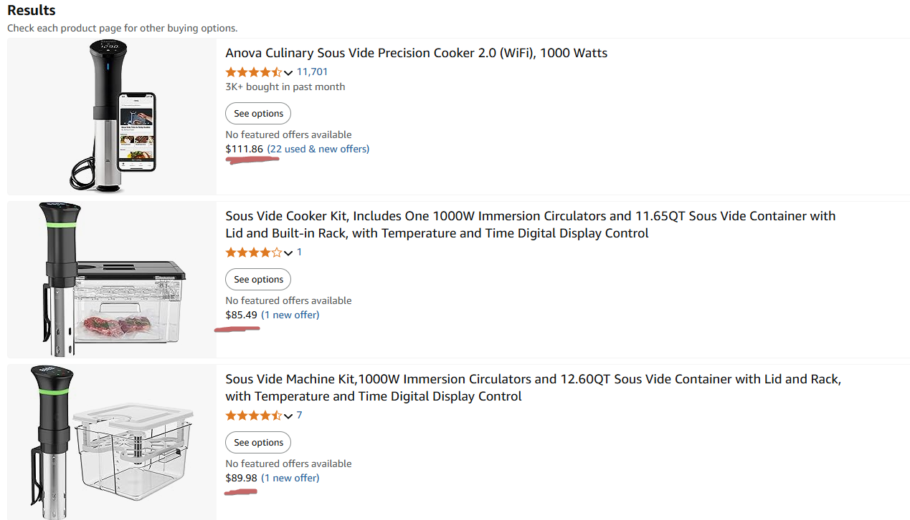
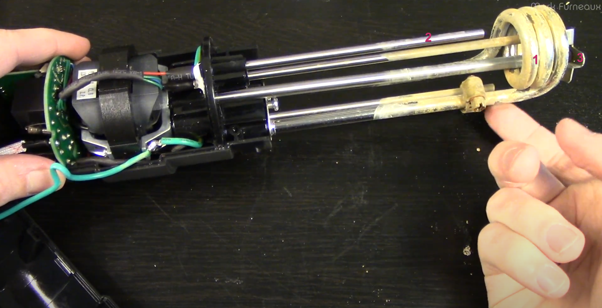
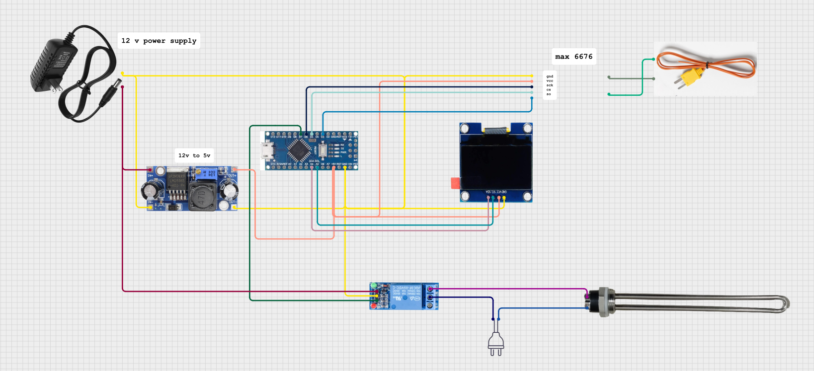
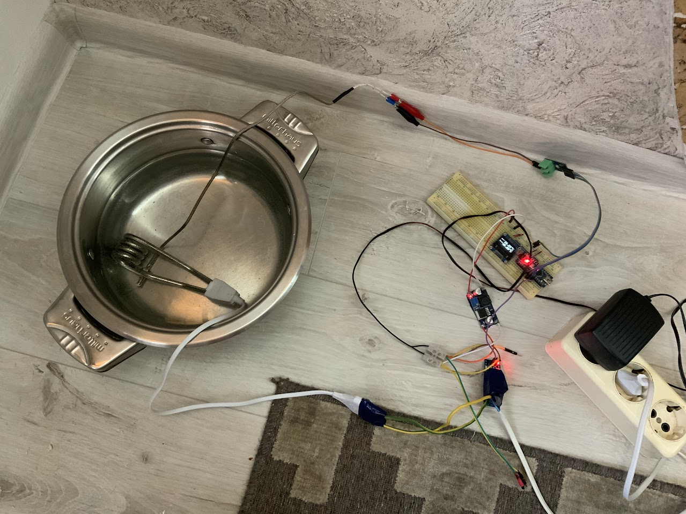

# Self-made sous-vide
My culinary adventures brought me to the intriguing device named sous vide. The main gimmick of it is its ability to maintain a stable desired temperature for as long as you need.  
## Research
Store-bought solutions were out of my budget ($100+ for a basic model).
 
So I decided to make my own bootleg version of it.
Scavenging YouTube yielded pretty good results; I found detailed sous-vide disassembly.

## Components
To put it simply, the device consists of the aforementioned parts:
1. Heating element
2. Temperature sensor
3. Circulator (fan)
Temperature sensor probes temperature of water, and if needed, engages heating element; fan is used to circulate water so the overall temperature is even.  
## My version
To test the contraption, I've built the simplest version without circulator and controls.
Here is the wiring diagram on how to connect everything:
 
And this is how it looks IRL.

